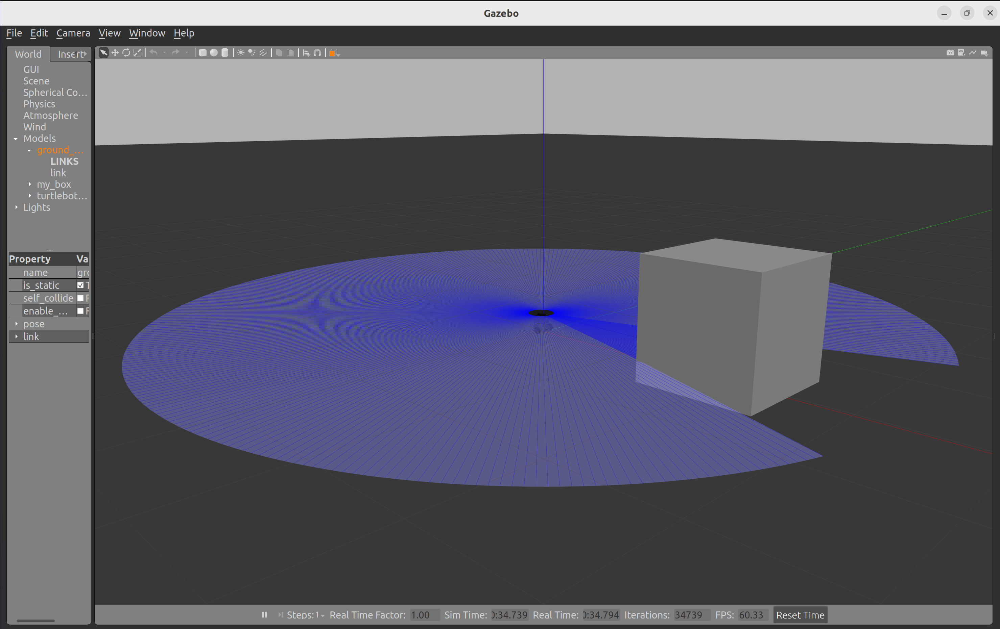
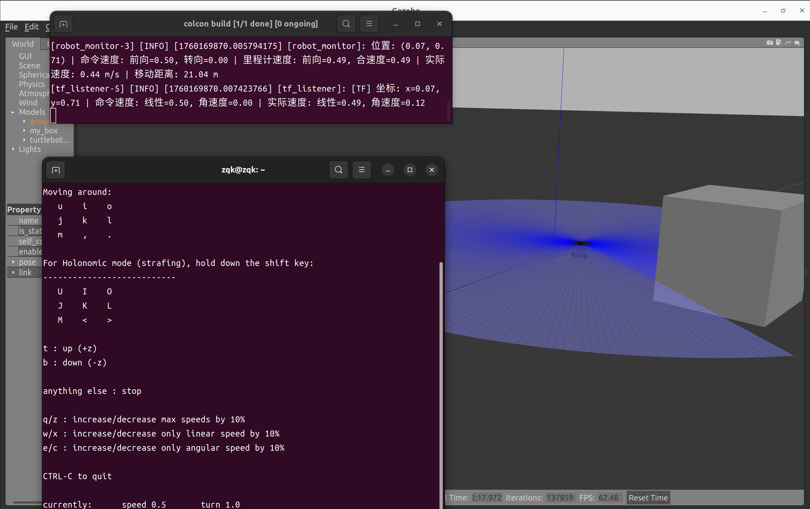
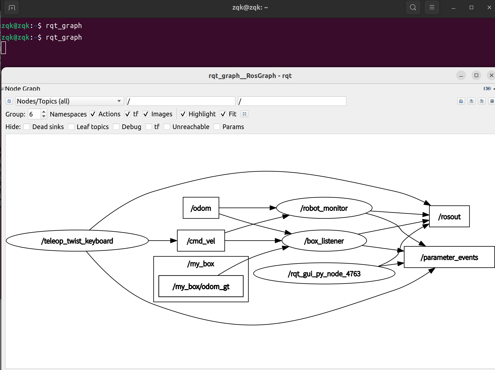

# my_robot_sim
## 目录结构
```
ros2_ws/
└── src/
    └── my_robot_sim/
        ├── package.xml
        ├── setup.py
        ├── setup.cfg
        ├── resource/
        │   └── my_robot_sim
        ├── my_robot_sim/
        │   ├── __init__.py
		│	├── robot_monitor.py
	    │   ├── wasd_controller.py
        │   ├── box_listener.py
        │   └── tf_listener.py
        ├── launch/
	    │   ├── all_nodes.launch.py
	    │   └── simulation.launch.py
        └── worlds/
            └── my_world.world

```
## 功能实现
- 启动Gazebo
```
# 编译
cd ~/ros2_ws
colcon build --packages-select my_robot_sim
source install/setup.bash

# 使用launch文件启动
ros2 launch my_robot_sim simulation.launch.py
```

- 启用键盘控制
```
cd ~/ros2_ws
source install/setup.bash
ros2 run teleop_twist_keyboard teleop_twist_keyboard
```

- 查看话题关系
```
rqt_graph
```

- 使用rviz2可视化
```
rviz2
```
